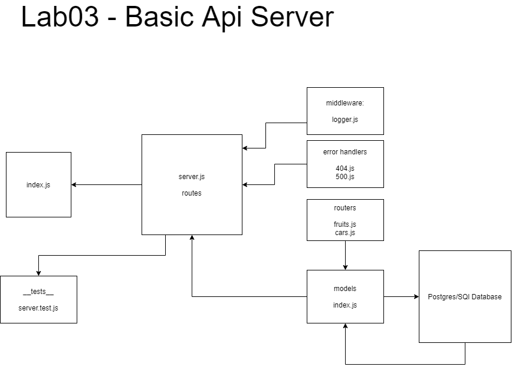

# basic-api-server

## Description

Dynamic API Phase 2: Perform CRUD Operations on a database

## Author

Ayrat Gimranov

## Collaborators

Alex White (instructor)

## Version

1.1.0

## Resources

Code Feloows 401: JS demo code (Lab 3) - <https://github.com/codefellows/seattle-javascript-401n19/tree/main/class-03/demo/api_server_class_demo>

## Deployed Sites

Prod branch -- https://ayrat-server-deploy-prod.herokuapp.com/
Dev branch -- https://ayrat-server-deploy-dev.herokuapp.com/

## UML

;